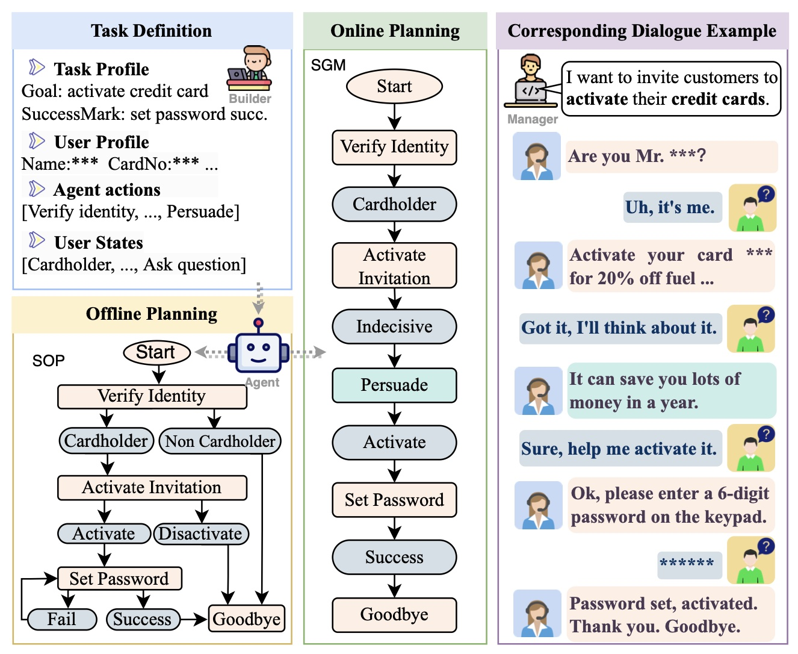
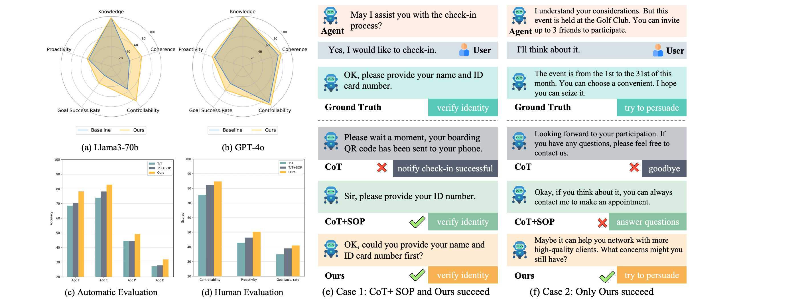

```
Note: Our role-play framework code and SOP dialogue dataset are available now, and SGM will be released upon paper acceptance.
```

# 🛠️ ChatSOP: An SOP-Guided MCTS Planning Framework for Controllable LLM Dialogue Agents

<div align="center">
 <a href='https://arxiv.org/pdf/2407.03884'></a> &nbsp;&nbsp;&nbsp;&nbsp;&nbsp;&nbsp;
 <a href=''></a> &nbsp;&nbsp;&nbsp;&nbsp;&nbsp;
 <a href='https://www.python.org/'></a> &nbsp;&nbsp;&nbsp;&nbsp;&nbsp;

 <br>
 <br>
</div>



*Figure: The pipeline of ChatSOP 🔍, includes: task definition, offline prediction of standard operating procedure (SOP), 
and online planning of the action path by SOP-guided MCTS (SGM).*

`where control demands are highlighted in orange.
The right panel is an example of dialogue following the SOP for bank credit card activation.`

## 📖 Overview

**ChatSOP** is a groundbreaking framework that enhances **process control precision** in Large Language Model (LLM)-powered dialogue systems through innovative integration of **Standard Operating Procedures (SOP)** and **Monte Carlo Tree Search (MCTS)**.

🌟 **Why Process Control Matters?**  
Imagine critical scenarios requiring strict procedural compliance:  
- Credit card activation missing identity verification  
- Medical consultations skipping symptom checks  
- E-commerce bots mishandling return processes  

ChatSOP solves these challenges with **27.95% higher action accuracy** compared to GPT-3.5 baselines.

---

## 🔍 Core Innovation: Human-Level Process Mastery

Our **Dual-Engine Architecture (SOP-MCTS)** combines:  
1️⃣ **SOP Engine**: Transforms business manuals into executable process graphs  
2️⃣ **MCTS Engine**: Employs Monte Carlo simulations for optimal dialogue pathfinding  

**Key Benefits**:  
✅ Strict procedural compliance🛠️  
✅ Dynamic decision optimization🧠  
✅ Compatible with both closed and open-source LLMs🤖

📈 **Experiment Performance**: Achieves 91.19% process controllability in real scenarios.

---

## 📊 Dataset: SOPDAIL
**SOPDAIL** is the first Chinese dataset with SOP annotations for controllable dialogue research:
- **3,114 dialogues** | **23,897 turns** | **32 domains** (banking, healthcare, education, etc.)
- Includes **strict procedural constraints** (74%) and **proactive interactions** (26%).

An Example of Dialogue:
```
Agent Action: Greet
Agent Response: Hi, this is the customer service center of the ** Bank Credit Card Department.

User Response: Hi!
User State: Greet

Agent Action: VerifyIdentity
Agent Response: Hi, am I speaking with Ms. Hao **?

User Response: Yes, that's right.
User State: Cardholder

Agent Action: IntroduceActivationActivities.
Agent Response: Ms. Hao, thank you for applying for our platinum credit card. To reward our new customers, we currently have an activation promotion that offers a 12\% discount on fuel for one year. Once you activate your credit card, you can enjoy this benefit.

User Response: That sounds great, but I've never used a credit card before and I'm a bit worried it might be troublesome.
User State: WorryAndDoubt

Agent Action: RelieveDoubts
Agent Response: Ms. Hao, you don't have to worry at all. Activating a credit card is very simple. You can choose to handle it at the bank counter, or you can activate it through the mobile banking APP or by calling our credit card customer service hotline for self-activation. The whole process is very convenient and fast.

User Response: Oh, I see. That's good to know.
User State:  HabitualResponseAndContinue

Agent Action:  AttemptPersuasion 
Agent Response: Yes, and after activation, you can also set a transaction password to ensure the security of your card usage. Our platinum credit card is free of annual fees for the first year, and you can waive the annual fee by swiping the card three times a year. This is not only safe and convenient but also comes with many promotional activities.

User Response: That sounds like a great deal, please activate it for me.
User State: Activate

Agent Action: SetPassword
Agent Response: Thank you for your trust. To ensure the security of your card transactions, please set a 6-digit transaction password.

User Response: Sure, my transaction password is ******.
User State: Success

Agent Action: Thank
Agent Response: Ms. Hao, your credit card has been successfully activated, and the transaction password has been set. You can now use your credit card normally.

User Response: Thank you, it's really convenient.
User State: Thank

Agent Action: Goodbye
Agent Response: You're welcome, Ms. Hao. If you have any questions, you can call our customer service hotline at any time. I wish you a happy life, goodbye!

User Response: Okay, goodbye!
User State: Goodbye
```
---


## 📈 Results
| Model          | Action Accuracy (↑) | Controllability (↑) | Proactivity (↑) |
|----------------|----------------------|----------------------|------------------|
| GPT-4o + CoT| 69.64%           | 74.34%           | 51.30%       |
| GPT-3.5 + SGM  | 76.52%               | 80.42%               | 33.10%           |
| **GPT-4o + SGM**| **86.37%**           | **91.19%**           | **60.42%**       |
| Llama3-70B + SGM| 78.35%              | 82.86%               | 49.18%           |


🌟 **Main results**：

🚀 Based on SGM (our), significant improvements have been achieved on both open-source and closed-source foundation models.




🌟 **More analysis results**:

🔹 (a)-(b) presenting human evaluation results for Llama3-70b and GPT-4o models based on the five proposed metrics; 

🔹 (c)-(d) comparing ToT with our method (SGM) through both automatic and human evaluations, demonstrating the superiority of our approach; 

🔹 (e)-(f) providing two case studies to further illustrate the advantages of our method.

See [paper](https://arxiv.org/pdf/2407.03884) for full experimental details.

---

## 🌐 Use Cases
**Zero-Tolerance Domains**:  
▸ 💳Banking: `ID Verification → Password Setup → Account Activation`  
▸ 💊Healthcare: `Symptom Check → Medical History → Triage`  
▸ 📦E-commerce: `Return Request → Evidence Review → Logistics`  

The applications in which the aforementioned cases exist.

• 💰Financial Service Automation  
• 📞Intelligent Customer Support  
• 🏥Medical Consultation Systems  
• 🏛️Government Service Navigation  
• 🎓Educational Tutoring Bots  

---

## 📥 Get Started Now

⭐ **Star this repository** to stay updated!

[](https://star-history.com/#PCA-anonymous/PCA)

---

## 🤝 Join the Revolution

Let's build together:  
✅ Ultra-reliable process bots  
✅ Next-gen decision engines  
✅ Human-centric conversation experiences  

Contributions via PRs and Issues are warmly welcomed!

---

> **Academic Citation**:  
> Our paper details the technical implementation.  
> ```bibtex
> @misc{li2025chatsopsopguidedmctsplanning,
>      title={ChatSOP: An SOP-Guided MCTS Planning Framework for Controllable LLM Dialogue Agents}, 
>      author={Zhigen Li and Jianxiang Peng and Yanmeng Wang and Yong Cao and Tianhao Shen and Minghui Zhang and Linxi Su and Shang Wu and Yihang Wu and Yuqian Wang and Ye Wang and Wei Hu and Jianfeng Li and Shaojun Wang and Jing Xiao and Deyi Xiong},
>      year={2025},
>      eprint={2407.03884},
>      archivePrefix={arXiv},
>      primaryClass={cs.CL},
>      url={https://arxiv.org/abs/2407.03884
> }
> ```
