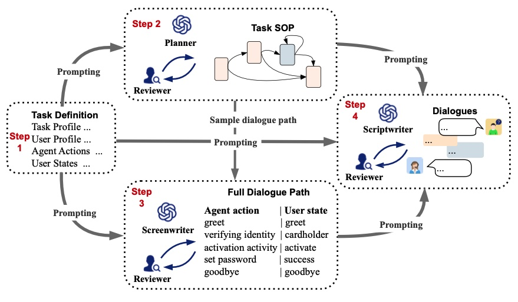

# 📋 Annotation Guidelines 

🌟 *Creating high-quality dialogue annotations just got easier! Follow this structured guide to ensure consistency and accuracy in your work.* 🌟

  
*Figure: Our orleplay framwork* 🔍

---

## 🔑 Key Overview
Our role-playing SOP dialogue dataset creation framework is a human-machine collaborative framework. Before annotators begin annotation, AI algorithm engineers should use LLM to generate annotation data corresponding to each step based on the four-step role-playing framework. The code for each step can be found in the aforementioned code repository. After generating the files to be annotated, they are handed over to the annotators for annotation.

---

## 🚀 Step 1: Task Definition Annotation  
**Objective:** Define real-world domain tasks using SOP (Standard Operating Procedures) and dialogue-based workflows.

The task should come from various domains in the real world, and the task process can be described with core steps using SOP. The task can be completed in the form of a dialogue between the agent and the user. 

### 📘 What to Annotate:
- **`Task Profile`** *(Mission Critical!)*  
  Must include:  
  ✅ `agent_identity` (Who is the AI agent?)  
  ✅ `agent_goal` (What's the agent's objective?)  
  ✅ `success_mark` (How is success measured?)  
  ➕ Add extra domain-specific context if needed.

- **`User Profile`** 👤  
  Provide user details relevant to the dialogue (e.g., name, background).

- **`Agent Actions`** 🤖  
  List dialogue actions the agent can perform to complete the task.

- **`User State`** 📊  
  Track the user's status/progress based on their input during the conversation.

---

## 🛠️ Step 2: SOP Creation  
**Objective:** Build a Standard Operating Procedure (SOP) flowchart for Step 1 tasks.

### 📘 What to Annotate:
- **`SOP Vertexes`** 🧩  
  Nodes selected from *Agent Actions* and *User States* to form the core flowchart.

- **`SOP Connections`** 🔗  
  Define relationships between nodes:  
  ⏩ **Start:** Always begins with `Agent.Start`  
  ⏹️ **End:** Concludes with `Agent.PoliteEnd` (only one leaf node allowed).

---

## 🧩 Step 3: Dialogue Path Validation  
**Objective:** Ensure LLM-generated conversation paths align with the SOP.

The dialogue path is a sequence of interactive actions generated by the LLM based on the SOP, representing a specific user completing a conversation in a particular setting. It is necessary to check whether the dialogue actions in the path follow the order in the core SOP. At the same time, for agent actions that are not part of the SOP, it is necessary to check whether they reflect the agent's proactivity, that is, whether the agent is striving to guide the conversation toward the task goal.

### 📌 Key Checks:
1. **Order Compliance** ✅  
   Do dialogue actions follow the SOP sequence?  
2. **Proactive Agent Behavior** 💡  
   For non-SOP agent actions: Do they actively guide the conversation toward the task goal?  

---

## ✏️ Step 4: Quality Refinement  
**Objective:** Polish dialogues for accuracy and readability.

Annotators need to correct the dialogue content and dialogue actions (task status) to ensure they are consistent with the background knowledge provided for the task, comply with the constraints of the SOP, and adhere to common sense. Additionally, they should correct the grammatical correctness and fluency of the dialogue.

### 📘 Correction Focus:
- **Content Consistency** 🔄  
  Align with task background knowledge and SOP constraints.
- **Common Sense Adherence** 🌐 
  Ensure realism and logical flow.
- **Grammar & Fluency** ✨  
  Fix errors and improve dialogue naturalness.

---

🔥 *Happy annotating! Let's build robust conversational AI together!* 🤖💬